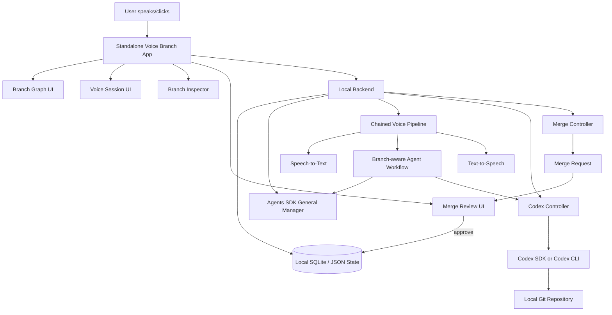

# Voice-first Agent Branch Manager — MVP Build Spec

## 0. Product definition

Build a local, voice-first control layer for long-horizon Codex work.

The app lets you see a coding project as a tree/graph of agent branches, speak to any branch, create temporary scratch voice sessions over any agent/chat/branch, delegate implementation work to Codex, and selectively merge useful outcomes back into the durable project state.

The core product loop is:

```text
See branch → speak/scratch → delegate to Codex if needed → summarize → approve merge
```

This is not full Morticus. It is the smallest useful system for:

```text
Codex threads + visual branch hierarchy + voice-first interaction + scratch agents + reviewable merge-back
```

---

## 1. Updated vision

You are using Codex for coding workflows that naturally branch over time.

A master agent starts with the high-level project. As implementation expands, you fork it into smaller branches: architecture, UI, backend, tests, voice adapter, Codex integration, merge logic, and so on. Each branch has a specific purpose and may itself fork into child branches.

You want to:

1. See the project as a visual parent/child agent hierarchy.
2. Rename branches so each branch reflects its task.
3. Click any branch and understand what it owns.
4. Resume or fork the related Codex thread.
5. Speak to any branch instead of typing prompts.
6. Turn any branch into a temporary scratch voice agent for thinking out loud.
7. Keep scratch conversations disposable unless explicitly merged.
8. Generate merge summaries from branches or scratch sessions.
9. Review and approve what gets written back to parent state.
10. Use Codex as the coding substrate rather than rebuilding a coding agent.

The intended UX should feel like:

> “I am looking at my project’s agent tree. I click a node, talk to it, let it ask Codex to do work if needed, and then decide whether the output becomes durable project state.”

---

## 2. Product name

Working name:

```text
Voice-first Agent Branch Manager
```

Shorter names:

```text
Voice Branch Manager
Agent Branch Cockpit
Codex Voice Branches
Scratch Agent
```

The most accurate full description:

```text
A voice-first branch manager for Codex agents, with disposable scratch voice sessions and reviewable merge-back.
```

---

## 3. Core product primitives

### 3.1 Project

A project is a local repo plus branch state.

Example:

```json
{
  "project_id": "morticus-voice-codex",
  "title": "Morticus Voice-Codex Layer",
  "repo_path": "/Users/aditya/dev/morticus",
  "root_branch_id": "root",
  "created_at": "2026-04-29T10:00:00+05:30",
  "updated_at": "2026-04-29T10:00:00+05:30"
}
```

### 3.2 Branch Agent

A branch agent is a durable workstream.

Examples:

```text
GM Root
Voice-Codex MVP
STT/TTS Adapter
Codex Thread Binding
Merge Summary Schema
React Flow Branch Graph
VS Code Companion Extension
```

A branch agent can:

```text
- hold a summary
- hold transcripts
- bind to a Codex thread/session
- have child branches
- be spoken to
- ask Codex to work
- produce merge summaries
```

### 3.3 Scratch Voice Agent

A scratch voice agent is a temporary speakable fork over an existing branch.

It is for messy thinking:

```text
- “Let me reason through this architecture.”
- “Explain what this branch is doing.”
- “Should this be a VS Code extension or standalone app?”
- “Help me think through the data model.”
```

Scratch sessions do not mutate durable branch state by default.

At the end of a scratch session, the app offers:

```text
[Merge selected insights]
[Save as note]
[Discard]
```

### 3.4 Merge Request

A merge request is a reviewable summary generated from a branch or scratch session.

It contains:

```text
- source branch/session
- parent target
- decisions made
- implementation changes
- files touched
- tests run
- open risks
- recommended parent summary update
- proposed new tasks
```

Nothing is persisted upward without approval.

---

## 4. Recommended product direction

Build a standalone local app first.

Do not start with a VS Code extension as the main app.

Reason:

```text
The primary experience is not “editor sidebar”.
The primary experience is “I speak to my agents”.
```

VS Code should become a companion later, not the core product.

Recommended sequence:

```text
MVP-0: Standalone voice-first local app
MVP-1: Codex SDK/CLI integration and branch persistence
MVP-2: VS Code companion extension
MVP-3: optional realtime speech-to-speech mode
```

---

## 5. Why standalone first

A standalone app gives first-class control over:

```text
- microphone capture
- push-to-talk
- audio playback
- branch graph layout
- scratch voice sessions
- transcript review
- merge approval
- background Codex task panels
```

A VS Code extension is excellent for:

```text
- opening files
- showing diffs
- showing a branch tree in the editor
- jumping to touched files
- running commands from the command palette
```

But if voice is critical, the product should not begin as “VS Code extension with a mic button.”

It should begin as:

```text
A voice-first agent cockpit that controls Codex.
```

---

## 6. External technical assumptions

These assumptions guide the architecture.

1. OpenAI’s voice-agent guidance separates speech-to-speech live audio from a chained voice pipeline. A chained pipeline gives the app explicit control over transcription, text reasoning, and speech output, which fits this product because Codex and branch state are text-native.
2. OpenAI Agents SDK voice pipelines can transcribe input audio, run a workflow, and convert workflow output back into audio.
3. Codex SDK supports long-running thread-style work where a thread can be continued through repeated runs or resumed by thread ID.
4. Codex CLI supports local transcripts and resume/fork-style workflows, which are aligned with durable branch state.
5. React Flow is suited for node/edge graph UIs and should be used for the branch graph.
6. VS Code webviews and tree views are useful for a future companion extension, but they should not own the initial voice-first experience.

References:

- OpenAI Voice Agents guide: https://developers.openai.com/api/docs/guides/voice-agents
- OpenAI Agents SDK voice pipeline: https://openai.github.io/openai-agents-python/voice/pipeline/
- OpenAI Codex SDK: https://developers.openai.com/codex/sdk
- OpenAI Codex CLI features: https://developers.openai.com/codex/cli/features
- React Flow: https://reactflow.dev/
- VS Code Webview API: https://code.visualstudio.com/api/extension-guides/webview
- VS Code Tree View API: https://code.visualstudio.com/api/extension-guides/tree-view

---

## 7. High-level architecture



---

## 8. Stack recommendation

### 8.1 Frontend

Use:

```text
Vite + React + TypeScript + React Flow
```

Why:

```text
- fast local frontend
- strong TypeScript compatibility
- React Flow gives visual branch graph
- browser APIs support microphone/audio UX more naturally than editor webviews
```

Alternative:

```text
Electron or Tauri wrapper after web MVP works
```

Do not begin with Electron unless native desktop packaging is immediately needed.

### 8.2 Backend

Use one of two paths.

Recommended path:

```text
Node.js + TypeScript + Fastify + SQLite
```

Reason:

```text
- matches frontend TypeScript
- can wrap Codex SDK
- can spawn Codex CLI
- simple local daemon
```

Acceptable path:

```text
Python + FastAPI + SQLite + OpenAI Agents SDK
```

Reason:

```text
- OpenAI Agents SDK Python voice pipeline is straightforward
- simple for prototyping voice workflows
```

Decision:

```text
Use TypeScript if Codex SDK integration is primary.
Use Python if Agents SDK voice pipeline speed is primary.
```

For this product, start with TypeScript backend plus minimal Python helper only if needed for voice pipeline support.

### 8.3 Storage

Use local project files first.

```text
.voice-branches/
  project.json
  branches/
    root.json
    voice-codex-mvp.json
    stt-tts-adapter.json
  transcripts/
    root.md
    stt-tts-adapter.md
  scratches/
    scratch_001.json
    scratch_001.md
  merges/
    merge_001.md
```

Then add SQLite when queries become annoying.

Practical recommendation:

```text
Store canonical branch/session state in SQLite.
Also export human-readable markdown files for transcripts and merges.
```

---

## 9. UI experience

The app has four primary screens.

### 9.1 Project Home

Purpose:

```text
Pick the repo/project you want to speak to.
```

Layout:

```text
┌────────────────────────────────────────────┐
│ Voice-first Agent Branch Manager           │
├────────────────────────────────────────────┤
│ Projects                                   │
│                                            │
│ [Morticus Voice-Codex Layer]               │
│  repo: /Users/aditya/dev/morticus          │
│  active branches: 8                        │
│  scratch sessions: 3 unmerged              │
│  open merges: 2                            │
│                                            │
│ [Noon Pricing Engine]                      │
│  repo: /Users/aditya/dev/pricing-engine    │
│  active branches: 4                        │
└────────────────────────────────────────────┘
```

Actions:

```text
- Create project
- Open project
- Import repo
- Resume last active branch
```

### 9.2 Project Branch Graph

Purpose:

```text
Show how the agentic project is evolving.
```

Layout:

```text
┌──────────────────────────────────────────────────────────────┐
│ Project: Morticus Voice-Codex Layer                          │
├──────────────────────┬───────────────────────┬───────────────┤
│ Branch Tree          │ Visual Graph           │ Inspector     │
│                      │                       │               │
│ GM Root              │ [GM Root]              │ Branch:       │
│ └─ Voice-Codex MVP   │    ↓                  │ STT/TTS       │
│    ├─ STT/TTS        │ [Voice-Codex MVP]      │ Adapter       │
│    ├─ Codex Binding  │    ├─ [STT/TTS]        │               │
│    ├─ Merge Schema   │    ├─ [Codex Binding]  │ [Speak]       │
│    └─ Graph UI       │    └─ [Merge Schema]   │ [Scratch]     │
│                      │                       │ [Ask Codex]   │
└──────────────────────┴───────────────────────┴───────────────┘
```

Primary actions:

```text
- Speak to branch
- Create scratch voice session
- Fork child branch
- Rename branch
- Resume Codex
- Ask Codex
- Generate merge summary
```

### 9.3 Branch Voice Session

Purpose:

```text
Continue durable work on a selected branch by speaking.
```

Layout:

```text
┌────────────────────────────────────────────┐
│ Speaking to Branch: STT/TTS Adapter         │
├────────────────────────────────────────────┤
│ Context loaded:                             │
│ - branch summary                            │
│ - parent summary                            │
│ - recent branch transcript                  │
│ - linked Codex thread                       │
│                                            │
│          Hold Space to Talk                 │
│                                            │
│ Live transcript:                            │
│ You: What exactly remains here?             │
│ Agent: Three things remain...               │
│                                            │
│ Actions:                                   │
│ [Ask Codex] [Fork child] [Mark decision]    │
│ [Generate merge] [End session]              │
└────────────────────────────────────────────┘
```

Branch voice sessions can mutate branch transcript and branch state.

### 9.4 Scratch Voice Session

Purpose:

```text
Think out loud without polluting durable branch state.
```

Layout:

```text
┌────────────────────────────────────────────┐
│ Scratch Voice Session                       │
│ Source: STT/TTS Adapter                     │
├────────────────────────────────────────────┤
│ This session is disposable.                 │
│ Nothing is merged unless approved.          │
│                                            │
│          Hold Space to Talk                 │
│                                            │
│ You: Let's reason through whether this      │
│      should use realtime or chained voice.  │
│ Agent: The right first version is chained...│
│                                            │
│ Actions:                                   │
│ [Extract decisions] [Create task]           │
│ [Merge selected] [Save note] [Discard]      │
└────────────────────────────────────────────┘
```

Scratch sessions are not branches. They are temporary voice rooms attached to a branch.

---

## 10. Core flows

### 10.1 Create a project

User action:

```text
Create Project → select repo path → name project
```

System:

```text
1. Creates .voice-branches/
2. Creates root branch
3. Detects git repo metadata
4. Optionally detects existing Codex sessions
5. Opens branch graph
```

### 10.2 Create root branch

Initial root branch:

```json
{
  "id": "root",
  "title": "GM Root",
  "type": "branch",
  "parent_id": null,
  "status": "active",
  "summary": "Root planning and coordination branch for the project.",
  "codex_thread_id": null
}
```

### 10.3 Fork child branch

User action:

```text
Right click branch → Fork child
```

User enters:

```text
Name: STT/TTS Adapter
Purpose: Implement push-to-talk, transcription, and spoken response playback.
```

System:

```text
1. Creates child branch record
2. Adds edge parent → child
3. Creates branch transcript file
4. Optionally starts or forks Codex thread
5. Opens child branch inspector
```

### 10.4 Rename branch

User action:

```text
Rename branch
```

System:

```text
1. Updates branch title
2. Preserves branch id unless user explicitly changes slug
3. Adds rename event to branch transcript
```

### 10.5 Speak to branch

User action:

```text
Speak to Branch
```

System context packet:

```text
You are speaking as the branch agent for: STT/TTS Adapter.
Parent: Voice-Codex MVP.
Branch purpose: Implement push-to-talk, STT, TTS playback, and transcript persistence.
Current summary: ...
Recent transcript: ...
Codex thread: ...
Rules:
- Continue durable branch work.
- Ask clarifying questions only when necessary.
- Use Codex for repo-editing tasks.
- Summarize decisions explicitly.
```

### 10.6 Scratch over branch

User action:

```text
Create Scratch Voice Session
```

System context packet:

```text
You are a scratch voice agent attached to branch: STT/TTS Adapter.
This is a temporary reasoning room.
Do not mutate durable branch state.
Help the user think out loud.
At the end, extract possible decisions, tasks, and notes for review.
```

### 10.7 Ask Codex from branch

User says:

```text
Tell Codex to implement the simplest push-to-talk flow.
```

System builds task packet:

```text
Codex task for branch: STT/TTS Adapter
Repo: /Users/aditya/dev/morticus
Branch purpose: Implement push-to-talk, STT, TTS playback, transcript persistence.
Request: Implement the simplest push-to-talk flow.
Constraints:
- Do not add realtime speech-to-speech yet.
- Keep implementation local-first.
- Return files changed, tests run, and risks.
```

Codex returns:

```text
- summary
- files changed
- test status
- follow-up tasks
```

System appends result to branch transcript.

### 10.8 Merge scratch session

User action:

```text
End scratch → Extract insights
```

System generates:

```text
Potential decisions:
1. Use standalone voice-first app first.
2. Add VS Code extension later as companion.
3. Treat scratch sessions as disposable by default.

Potential tasks:
1. Implement ScratchVoiceSession model.
2. Add merge review UI.
3. Add context packet compiler.

Potential parent summary update:
The product is now defined as a voice-first branch manager with scratch voice sessions...
```

User selects what to merge.

System persists only selected items.

---

## 11. Data model

### 11.1 Project

```ts
export type Project = {
  id: string;
  title: string;
  repoPath: string;
  rootBranchId: string;
  createdAt: string;
  updatedAt: string;
};
```

### 11.2 Branch

```ts
export type BranchStatus =
  | "active"
  | "paused"
  | "blocked"
  | "ready_to_merge"
  | "merged"
  | "archived";

export type Branch = {
  id: string;
  projectId: string;
  title: string;
  parentId: string | null;
  status: BranchStatus;
  summary: string;
  purpose: string;
  codexThreadId?: string;
  transcriptPath: string;
  tags: string[];
  createdAt: string;
  updatedAt: string;
};
```

### 11.3 Edge

```ts
export type BranchEdge = {
  id: string;
  projectId: string;
  sourceBranchId: string;
  targetBranchId: string;
  relation: "forked_to" | "delegated_to" | "split_into";
  createdAt: string;
};
```

### 11.4 Scratch Voice Session

```ts
export type ScratchVoiceSession = {
  id: string;
  projectId: string;
  sourceBranchId: string;
  title: string;
  transcriptPath: string;
  extractedDecisions: ExtractedDecision[];
  extractedTasks: ExtractedTask[];
  extractedNotes: ExtractedNote[];
  mergeStatus: "unreviewed" | "partially_merged" | "merged" | "discarded";
  createdAt: string;
  updatedAt: string;
};
```

### 11.5 Merge Request

```ts
export type MergeRequest = {
  id: string;
  projectId: string;
  sourceType: "branch" | "scratch";
  sourceId: string;
  targetBranchId: string;
  title: string;
  summary: string;
  decisions: string[];
  tasks: string[];
  filesTouched: string[];
  testsRun: string[];
  risks: string[];
  proposedParentSummaryUpdate: string;
  status: "draft" | "approved" | "rejected" | "applied";
  createdAt: string;
  updatedAt: string;
};
```

---

## 12. Local file layout

```text
.voice-branches/
  project.json

  branches/
    root.json
    voice-codex-mvp.json
    stt-tts-adapter.json
    codex-thread-binding.json

  edges.json

  transcripts/
    root.md
    voice-codex-mvp.md
    stt-tts-adapter.md

  scratches/
    scratch_001.json
    scratch_001.md

  merges/
    merge_001.md
    merge_002.md

  codex/
    thread_map.json

  exports/
    project_snapshot.md
```

---

## 13. Backend API

### 13.1 Projects

```http
GET /api/projects
POST /api/projects
GET /api/projects/:projectId
```

### 13.2 Branches

```http
GET /api/projects/:projectId/branches
POST /api/projects/:projectId/branches
PATCH /api/branches/:branchId
POST /api/branches/:branchId/fork
POST /api/branches/:branchId/rename
```

### 13.3 Voice

```http
POST /api/branches/:branchId/voice/start
POST /api/branches/:branchId/voice/turn
POST /api/branches/:branchId/voice/end

POST /api/branches/:branchId/scratch/start
POST /api/scratches/:scratchId/turn
POST /api/scratches/:scratchId/extract
POST /api/scratches/:scratchId/discard
```

### 13.4 Codex

```http
POST /api/branches/:branchId/codex/start-thread
POST /api/branches/:branchId/codex/resume-thread
POST /api/branches/:branchId/codex/run
POST /api/branches/:branchId/codex/fork
```

### 13.5 Merge

```http
POST /api/branches/:branchId/merge-request
POST /api/scratches/:scratchId/merge-request
PATCH /api/merges/:mergeId
POST /api/merges/:mergeId/apply
```

---

## 14. Agent roles

### 14.1 General Manager Agent

Purpose:

```text
Own project-level reasoning and routing.
```

Responsibilities:

```text
- summarize project state
- explain branch hierarchy
- decide which branch should handle a spoken request
- create new branches when needed
- ask Codex for implementation only when repo work is required
- create merge summaries
```

### 14.2 Branch Agent

Purpose:

```text
Speak from the perspective of a specific branch.
```

Responsibilities:

```text
- answer questions about branch scope
- continue branch-specific reasoning
- delegate coding work to Codex
- update branch transcript
- prepare merge summaries
```

### 14.3 Scratch Voice Agent

Purpose:

```text
Temporary voice-first thinking room over any branch or agent.
```

Responsibilities:

```text
- help user reason verbally
- avoid durable mutation by default
- extract decisions/tasks/notes at end
- offer selective merge
```

### 14.4 Codex Worker

Purpose:

```text
Perform actual coding tasks in the repo.
```

Responsibilities:

```text
- inspect code
- edit files
- run tests
- explain diffs
- report risks
- continue branch-bound coding threads
```

---

## 15. Context packet design

### 15.1 Branch context packet

```text
BRANCH CONTEXT PACKET

Project: {project.title}
Repo: {project.repoPath}
Branch: {branch.title}
Branch ID: {branch.id}
Parent: {parent.title}
Status: {branch.status}
Purpose: {branch.purpose}
Summary: {branch.summary}
Codex Thread: {branch.codexThreadId}

Recent branch transcript:
{last_n_messages}

Relevant parent summary:
{parent.summary}

Rules:
- You are speaking as this branch agent.
- Stay scoped to this branch unless user asks to navigate.
- Use Codex only for repo/file/test work.
- Ask before mutating durable state.
- When decisions are made, mark them explicitly.
```

### 15.2 Scratch context packet

```text
SCRATCH VOICE CONTEXT PACKET

Project: {project.title}
Source Branch: {branch.title}
Purpose: {branch.purpose}
Summary: {branch.summary}

Mode: scratch voice session
Rules:
- This is temporary.
- Do not update durable branch state automatically.
- Help the user think out loud.
- At the end, extract decisions, tasks, and notes.
- Only selected items should be merged.
```

### 15.3 Codex task packet

```text
CODEX TASK PACKET

Project: {project.title}
Repo: {project.repoPath}
Branch: {branch.title}
Branch purpose: {branch.purpose}
Current branch summary: {branch.summary}

User request:
{request}

Constraints:
- Stay within this branch scope.
- Prefer minimal implementation.
- Run relevant tests if possible.
- Return structured output:
  1. Summary
  2. Files changed
  3. Tests run
  4. Risks
  5. Suggested next steps
```

---

## 16. Voice UX rules

### 16.1 Input mode

Start with push-to-talk.

```text
Hold Space → speak → release → process turn
```

Why:

```text
- cheaper than always-listening
- easier to debug
- fewer accidental turns
- simpler transcript segmentation
```

### 16.2 Response mode

Start with spoken response plus visible transcript.

Every answer should appear as:

```text
- audio playback
- text transcript
- optional structured extracted items
```

### 16.3 Interruptions

Do not implement interruption/barge-in in MVP-0.

Add later if the user needs natural live conversation.

### 16.4 Cost control

Default behavior:

```text
- no realtime speech-to-speech
- no always-listening
- no automatic full transcript resend
- compact branch context packets
- explicit Codex calls
```

---

## 17. Branch graph UI

Use React Flow.

Node types:

```text
RootBranchNode
BranchNode
ScratchSessionNode
MergeRequestNode
CodexTaskNode
```

### 17.1 Branch node

Displays:

```text
- title
- status
- agent type
- child count
- Codex thread indicator
- last updated
```

Example:

```text
┌──────────────────────────┐
│ STT/TTS Adapter           │
│ active · coder branch     │
│ Codex: linked             │
│ children: 2               │
└──────────────────────────┘
```

### 17.2 Scratch node

Scratch sessions should appear visually different.

Example:

```text
┌──────────────────────────┐
│ Scratch: Voice UX debate  │
│ temporary · unmerged      │
└──────────────────────────┘
```

Scratch nodes can be hidden by default to keep the graph clean.

Toggle:

```text
[Show scratch sessions]
```

### 17.3 Merge node

Example:

```text
┌──────────────────────────┐
│ Merge Request #12         │
│ pending approval          │
└──────────────────────────┘
```

---

## 18. Merge review UX

Merge review must be explicit.

Layout:

```text
┌────────────────────────────────────────────┐
│ Merge Review                               │
│ Source: Scratch Voice UX Debate             │
│ Target: Voice-Codex MVP                     │
├────────────────────────────────────────────┤
│ Decisions                                  │
│ [x] Standalone app first                    │
│ [x] VS Code extension later                 │
│ [ ] Realtime API immediately                │
│                                            │
│ Tasks                                      │
│ [x] Add ScratchVoiceSession model           │
│ [x] Add branch graph                        │
│ [ ] Add always-listening mode               │
│                                            │
│ Parent summary update                       │
│ [editable text area]                        │
│                                            │
│ [Apply selected] [Save draft] [Reject]      │
└────────────────────────────────────────────┘
```

Rule:

```text
No scratch output is durable until selected and approved.
```

---

## 19. Minimal MVP acceptance criteria

### Must have

```text
1. Create a project from a local repo path.
2. Show a root branch.
3. Create/fork child branches.
4. Rename branches.
5. Show branch hierarchy visually.
6. Select a branch and view summary/transcript.
7. Start a push-to-talk voice session with a branch.
8. Start a scratch voice session from a branch.
9. Save transcripts for branch and scratch sessions.
10. Generate a merge request from a branch or scratch session.
11. Approve selected merge items into parent branch summary.
12. Bind a branch to a Codex thread or run a Codex task from a branch.
```

### Should have

```text
1. React Flow graph with pan/zoom.
2. Branch status badges.
3. Files touched from Codex result.
4. Test status from Codex result.
5. Project snapshot export.
6. Search branches by title/purpose.
```

### Not in MVP

```text
1. Full realtime speech-to-speech.
2. Always-listening mode.
3. Multi-user collaboration.
4. Cloud sync.
5. Full VS Code extension.
6. Complex memory/RAG substrate.
7. Automatic merge without review.
```

---

## 20. Implementation plan

### Milestone 0 — Local project scaffold

Build:

```text
- Vite React frontend
- Node/Fastify backend
- local project loader
- .voice-branches folder creation
```

Done when:

```text
A repo can be initialized as a Voice Branch project.
```

### Milestone 1 — Branch state and graph

Build:

```text
- branch CRUD
- fork child branch
- rename branch
- React Flow graph
- branch inspector
```

Done when:

```text
You can create a visible parent/child branch tree and click nodes.
```

### Milestone 2 — Transcripts and summaries

Build:

```text
- branch transcript files
- append transcript entries
- branch summary field
- markdown export
```

Done when:

```text
Each branch has a readable transcript and summary.
```

### Milestone 3 — Scratch voice sessions

Build:

```text
- scratch session model
- scratch transcript
- scratch UI
- extract decisions/tasks/notes
- discard/save/merge actions
```

Done when:

```text
You can create a temporary scratch session and merge selected insights back.
```

### Milestone 4 — Voice pipeline

Build:

```text
- push-to-talk capture
- STT
- branch-aware workflow call
- TTS response
- visible transcript
```

Done when:

```text
You can speak to a selected branch and hear/see a response.
```

### Milestone 5 — Codex integration

Build:

```text
- Codex controller
- start/resume thread
- run task from branch
- parse structured Codex result
- append Codex result to transcript
```

Done when:

```text
You can say: “Ask Codex to implement X,” and the branch receives the result.
```

### Milestone 6 — Merge review

Build:

```text
- generate merge request
- editable merge review UI
- apply selected decisions/tasks/summary update
- mark source as merged/discarded
```

Done when:

```text
Nothing becomes durable without an explicit review step.
```

### Milestone 7 — VS Code companion

Later build:

```text
- VS Code sidebar branch tree
- open current project in voice app
- open touched files
- show merge requests
- jump from branch to diff
```

Done when:

```text
VS Code can act as the editor-side companion, but voice remains in the standalone app.
```

---

## 21. First version UI routes

```text
/                         Project home
/projects/:projectId       Branch graph
/projects/:projectId/branches/:branchId
                           Branch inspector
/projects/:projectId/branches/:branchId/speak
                           Branch voice session
/projects/:projectId/branches/:branchId/scratch
                           Scratch voice session
/projects/:projectId/merges/:mergeId
                           Merge review
/settings                   API keys, voice settings, Codex path
```

---

## 22. Settings

Required settings:

```text
OpenAI API key
Codex executable path or SDK mode
Default STT model
Default TTS voice
Push-to-talk key
Repo allowlist
Default sandbox/approval mode for Codex
```

Security rules:

```text
- Store secrets outside project files.
- Never write API keys into .voice-branches.
- Ask before running Codex with broad permissions.
- Prefer workspace-scoped repo access.
```

---

## 23. Codex integration modes

### 23.1 CLI mode

Use when speed matters.

```text
codex exec --cd /repo "task packet"
```

Pros:

```text
- fastest to implement
- easy to debug manually
- works with existing Codex CLI setup
```

Cons:

```text
- thread management may be less clean
- output parsing requires care
```

### 23.2 SDK mode

Use when branch-thread continuity matters.

```ts
const codex = new Codex();
const thread = codex.startThread();
const result = await thread.run(taskPacket);
const next = await thread.run(followUpTask);
```

Pros:

```text
- branch can map cleanly to Codex thread
- easier resume/continue
- better programmatic control
```

Cons:

```text
- slightly more integration work
```

Recommendation:

```text
Start with CLI mode if you want same-day prototype.
Move to SDK mode for serious branch-thread persistence.
```

---

## 24. Example branch tree

```text
GM Root
└── Voice-first Agent Branch Manager
    ├── Product UX
    │   ├── Branch graph
    │   ├── Branch inspector
    │   └── Merge review UI
    ├── Voice system
    │   ├── Push-to-talk STT
    │   ├── TTS playback
    │   └── Scratch voice sessions
    ├── Codex integration
    │   ├── Codex CLI wrapper
    │   ├── Codex SDK thread mapping
    │   └── Structured task packets
    └── VS Code companion
        ├── Tree sidebar
        └── Open touched files
```

---

## 25. Example scratch session

Source branch:

```text
Voice system → Scratch voice sessions
```

User says:

```text
Let me think through whether scratch sessions should appear in the main branch graph or be hidden by default.
```

Agent responds:

```text
They should be hidden by default, because scratch sessions are noisy and temporary. The graph should represent durable project evolution. Add a toggle: Show scratch sessions.
```

Extracted decision:

```text
Scratch sessions are hidden by default and shown through a toggle.
```

Extracted task:

```text
Add `showScratchSessions` UI toggle to branch graph.
```

Merge options:

```text
[x] Merge decision
[x] Create task
[ ] Append full transcript
```

---

## 26. Prompt templates

### 26.1 Branch agent system prompt

```text
You are the active branch agent for a long-horizon coding project.
You represent one durable branch in a parent/child agent tree.

Your job:
- answer questions about this branch
- keep reasoning scoped to this branch
- ask Codex to perform code work when needed
- keep decisions explicit
- prepare reviewable merge summaries

Do not silently mutate parent state.
If the user wants to merge, produce a merge request.
```

### 26.2 Scratch voice agent system prompt

```text
You are a scratch voice agent attached to a branch.
This is a temporary thinking session.
The user may ramble, explore, contradict themselves, or reason informally.

Your job:
- help the user think clearly
- keep track of useful insights
- avoid making durable changes
- at the end, extract decisions, tasks, and notes

Nothing from this session becomes durable unless the user explicitly approves it.
```

### 26.3 Codex task prompt

```text
You are Codex working inside a local repository for a specific branch of a larger agentic project.

Branch: {branch.title}
Purpose: {branch.purpose}
Current summary: {branch.summary}

Task:
{user_request}

Constraints:
- Keep changes minimal and scoped.
- Prefer readable implementation over cleverness.
- Run relevant tests when possible.
- Do not implement unrelated features.

Return:
1. Summary
2. Files changed
3. Tests run
4. Risks
5. Suggested next step
```

### 26.4 Merge request prompt

```text
Create a reviewable merge request from this source session into its parent branch.

Return:
- concise summary
- decisions made
- tasks created
- implementation changes
- files touched
- tests run
- risks
- proposed parent summary update

Do not claim anything was implemented unless the transcript/Codex output supports it.
```

---

## 27. MVP coding prompt for Codex

Use this to start implementation.

```text
We are building a local app called Voice-first Agent Branch Manager.

Goal:
Create a lightweight voice-first branch cockpit over Codex.

Core concepts:
- Project: local repo plus branch state
- Branch: durable agent workstream with parent/child hierarchy
- ScratchVoiceSession: temporary voice session attached to a branch, not durable by default
- MergeRequest: reviewable summary that selectively updates parent branch state

Stack:
- Vite + React + TypeScript frontend
- React Flow for graph visualization
- Node.js + Fastify backend
- Local JSON files first under .voice-branches/
- Codex CLI wrapper first; SDK later

Build MVP-0 and MVP-1 only:
1. Initialize project from repo path.
2. Create .voice-branches folder.
3. Create root branch.
4. Add branch CRUD.
5. Add fork child branch.
6. Add rename branch.
7. Add React Flow visual graph.
8. Add branch inspector.
9. Add transcript markdown file per branch.
10. Add placeholder actions for Speak, Scratch, Ask Codex, Generate Merge.

Do not implement real voice yet.
Do not implement full Codex SDK yet.
Keep schemas explicit and typed.
Return a short implementation plan before editing.
After editing, return files changed, tests run, and next steps.
```

---

## 28. Risks and mitigations

### Risk: voice becomes expensive

Mitigation:

```text
Use push-to-talk, chained voice pipeline, compact context packets, and explicit Codex calls.
```

### Risk: branch graph becomes noisy

Mitigation:

```text
Keep durable branches visible by default. Hide scratch sessions unless toggled.
```

### Risk: scratch sessions pollute project state

Mitigation:

```text
Scratch sessions are read/write isolated. Only selected merge items persist.
```

### Risk: Codex thread mapping becomes unreliable

Mitigation:

```text
Store codexThreadId per branch. Also persist transcript and task packets locally.
```

### Risk: trying to build too much

Mitigation:

```text
Start without realtime voice, VS Code extension, cloud sync, or RAG.
```

---

## 29. Definition of done for first useful version

The first useful version is done when this works:

```text
1. Open project.
2. See GM Root branch.
3. Fork child branch called “STT/TTS Adapter”.
4. Click the branch.
5. Add a text transcript entry.
6. Create a scratch session from the branch.
7. End scratch and extract decisions/tasks.
8. Approve selected items into parent summary.
9. See updated branch graph.
10. Run a placeholder Codex task from the branch.
```

The first voice version is done when this works:

```text
1. Click “Speak to Branch”.
2. Hold Space and speak.
3. App transcribes speech.
4. Branch agent responds.
5. App speaks response.
6. Transcript is saved.
7. User can generate merge summary.
```

---

## 30. Final product rule

The product has three verbs:

```text
Speak
Scratch
Merge
```

Speak to continue a durable branch.

Scratch to temporarily turn any branch, agent, or chat into a voice-thinking room.

Merge to selectively write useful conclusions back into the project.

Everything else is implementation detail.
