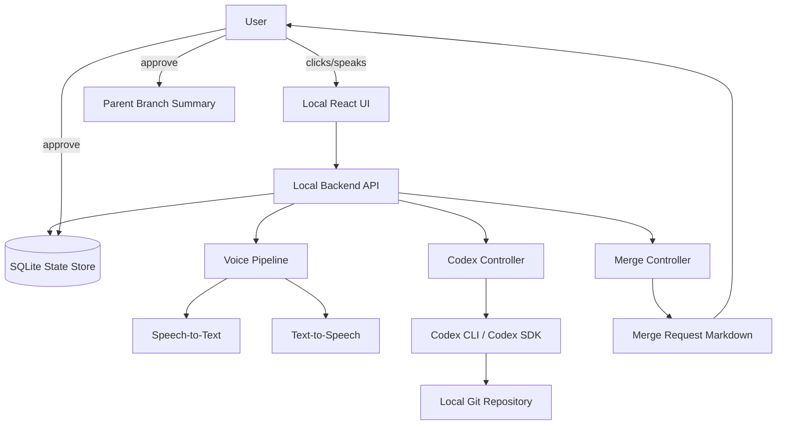

# Voice-Codex Branch Manager — MVP Build Spec

## 0. Product idea in one sentence

Build a lightweight local UI over Codex where a project evolves as a visible tree of agent threads: a master/root thread can fork into task-specific child branches, each branch can be renamed, queried, resumed, spoken to through a chained voice pipeline, and selectively merged back into its parent through a reviewable summary.

This is deliberately not full Morticus. It is the smallest useful version of:

```text
Codex threads + branch graph + voice fork + merge-back summaries
```

---

## 1. What I understand the vision to be

You are using Codex for long-horizon coding work. Over time, the work naturally becomes a hierarchy:

```text
Master project agent
  ├── backend architecture branch
  │     ├── database schema child
  │     └── API implementation child
  ├── frontend UI branch
  │     ├── React Flow graph child
  │     └── voice panel child
  └── testing / QA branch
        ├── unit tests child
        └── integration tests child
```

Today this hierarchy is mentally held by you through Codex sessions and renamed branches. The MVP makes that hierarchy visible and controllable.

You want to be able to:

1. See the project as a branch tree.
2. Rename branches based on task purpose.
3. Click any branch and see what it is responsible for.
4. Resume a branch in Codex.
5. Fork a branch into a child.
6. Ask a branch questions about its task.
7. Start a voice session with any branch.
8. Let the voice branch run Codex tasks.
9. End the voice session with a merge-back summary.
10. Approve what, if anything, gets written back to the parent.

The core UX should feel like:

> “I am looking at my agentic project tree. I click a branch. I speak to that branch. It can ask Codex to do work. It summarizes what happened. I decide what gets persisted.”

---

## 2. Design principle

Do not build a new coding agent.

Use Codex as the coding substrate.

The new product is only a control layer:

```text
Branch Manager UI
  ├── visual hierarchy
  ├── branch metadata
  ├── voice wrapper
  ├── Codex CLI/SDK bridge
  └── merge-back review
```

Codex remains responsible for:

```text
- reading repository context
- implementing code
- running tests
- creating diffs
- continuing coding sessions
- forking/resuming threads
```

The new app is responsible for:

```text
- showing the agent/thread hierarchy
- mapping human-readable branch names to Codex sessions
- starting voice interactions
- generating task packets
- saving branch transcripts
- producing merge summaries
- asking the user before persistence
```

---

## 3. Recommended stack

### Frontend

Use a local React app.

Recommended:

```text
Vite + React + TypeScript + React Flow
```

Why React Flow:

- It is designed for interactive node-based UIs.
- A project branch tree is naturally represented as nodes and edges.
- It supports custom nodes, custom edges, controls, minimap, selection, dragging, and graph interactions.

### Backend

Use a local Node/TypeScript service.

Recommended:

```text
Node.js + Fastify/Express + SQLite + Codex SDK/CLI wrapper
```

Why Node/TypeScript:

- Codex SDK has a TypeScript SDK.
- The UI is also TypeScript.
- Easier to share schemas between frontend and backend.
- Easier to wrap child processes like `codex exec`, `codex fork`, and `codex resume`.

### Voice

Use chained voice pipeline first:

```text
mic audio → STT → text agent/Codex task → TTS → spoken response
```

Do not start with native low-latency speech-to-speech Realtime.

The chained pipeline is better for this MVP because it gives you:

```text
- full transcript
- easy debugging
- cheaper control
- deterministic branch persistence
- compatibility with existing text-based Codex workflows
```

---

## 4. System architecture



---

## 5. UI experience

The interface has four main regions.

```text
┌──────────────────────────────────────────────────────────────┐
│ Project: morticus-voice-codex                                │
├──────────────────────────────────────────────────────────────┤
│                                                              │
│  Branch Graph                          Branch Inspector      │
│  ┌──────────────────────────────┐     ┌───────────────────┐ │
│  │ Master GM                    │     │ Frontend UI Branch │ │
│  │   ├─ Voice pipeline           │     │ status: active     │ │
│  │   ├─ Frontend UI              │────▶│ agent: coder       │ │
│  │   │    └─ React Flow graph    │     │ codex thread: ...  │ │
│  │   └─ Backend bridge           │     │                   │ │
│  └──────────────────────────────┘     │ [Resume Codex]    │ │
│                                        │ [Fork Child]      │ │
│                                        │ [Start Voice]     │ │
│                                        │ [Create Merge]    │ │
│                                        └───────────────────┘ │
│                                                              │
├──────────────────────────────────────────────────────────────┤
│ Activity / Transcript / Codex Events                         │
└──────────────────────────────────────────────────────────────┘
```

### 5.1 Project home

The home screen shows all projects.

Each project card shows:

```text
- project name
- repo path
- root branch
- active branches
- open merge requests
- last activity
```

Actions:

```text
[Open Project]
[Create Project]
[Import Codex Session]
```

### 5.2 Branch graph screen

This is the main screen.

Each branch is a node.

Node contents:

```text
Branch name
Agent role
Status
Last activity
Open tasks count
Merge status
Voice availability
```

Example node:

```text
┌────────────────────────────┐
│ Frontend Graph UI          │
│ agent: coder               │
│ status: active             │
│ last: 14 min ago           │
│ [voice] [resume] [fork]    │
└────────────────────────────┘
```

Edges mean:

```text
parent branch → child branch
```

Edge labels can show why the child was created:

```text
"split UI work"
"investigate bug"
"refactor backend"
"test harness"
```

### 5.3 Branch inspector

Clicking a node opens the branch inspector.

Sections:

```text
Branch identity
- name
- branch id
- parent id
- agent role
- repo path
- Codex thread id / session reference

Purpose
- one-paragraph mission
- current acceptance criteria
- constraints

State
- current status
- last summary
- last Codex result
- files touched
- tests run

Actions
- Resume in Codex
- Fork child
- Rename
- Start voice
- Ask question
- Create merge request
```

### 5.4 Voice branch panel

When you click **Start Voice**, a right-side drawer opens.

```text
┌────────────────────────────────────────┐
│ Voice: Frontend Graph UI               │
├────────────────────────────────────────┤
│ Context loaded:                        │
│ ✓ branch summary                       │
│ ✓ parent summary                       │
│ ✓ last 20 events                       │
│ ✓ repo path                            │
│ ✓ Codex thread id                      │
│                                        │
│ [Hold to Talk]                         │
│                                        │
│ You: What is this branch responsible...│
│ Agent: This branch owns the graph...   │
│                                        │
│ Suggested actions:                     │
│ [Ask Codex to inspect files]           │
│ [Create child branch]                  │
│ [Summarize for merge]                  │
└────────────────────────────────────────┘
```

Voice is not global. Voice is always attached to a selected branch.

This matters because every spoken turn has a clear context:

```text
current_project
current_branch
current_agent_role
current_codex_thread
current_repo
parent_branch
```

---

## 6. Core UI flows

## Flow A — Create a project

```text
1. User opens app.
2. Clicks “Create Project”.
3. Enters:
   - project name
   - repo path
   - root agent name
   - optional existing Codex session/thread
4. App creates root branch.
5. Graph shows one node: Master GM.
```

Root branch default:

```json
{
  "name": "Master GM",
  "agent_role": "general_manager",
  "purpose": "Coordinate the project and decide when to fork work into child branches.",
  "status": "active"
}
```

---

## Flow B — Fork a child branch

```text
1. User clicks a branch node.
2. Clicks “Fork Child”.
3. Modal opens:
   - child branch name
   - purpose
   - agent role
   - acceptance criteria
   - whether to fork Codex session or start fresh
4. App creates child branch record.
5. If selected, app calls Codex fork/resume mechanism.
6. Graph updates with a new child node.
```

Fork modal:

```text
Create child branch

Parent:
Frontend UI

Child name:
React Flow graph implementation

Agent role:
Coder

Purpose:
Implement the visual branch hierarchy screen.

Acceptance criteria:
- Show parent/child nodes
- Click node to inspect branch
- Start voice from selected node
- Save layout positions
```

---

## Flow C — Rename a branch

```text
1. User clicks branch node.
2. Clicks branch title or “Rename”.
3. Enters new name.
4. App updates branch name.
5. Graph node label updates.
```

This is important because your branch tree is only useful if branch names stay semantically meaningful.

Bad names:

```text
session 17
child 4
try again
```

Good names:

```text
Codex SDK bridge
Voice branch drawer
Merge summary schema
React Flow graph UI
```

---

## Flow D — Ask a branch a question

Text path:

```text
1. Click branch.
2. Type question in inspector.
3. Backend creates a bounded question prompt.
4. Sends it to Codex SDK/CLI against that branch/session.
5. Response appears in activity panel.
6. Branch summary may be updated only if user accepts.
```

Example:

```text
Question:
“What exactly is this branch blocked on?”

Generated Codex prompt:
“You are answering about branch `React Flow graph implementation`.
Use the current repo and branch state. Do not edit files.
Return:
1. current objective
2. completed work
3. blockers
4. next recommended action.”
```

---

## Flow E — Start voice with a branch

```text
1. User clicks branch.
2. Clicks “Start Voice”.
3. App compiles branch context.
4. Voice drawer opens.
5. User holds push-to-talk.
6. Audio is transcribed.
7. Transcribed text is sent to the branch GM.
8. Branch GM either answers directly or calls Codex.
9. Response is converted to speech.
10. Branch transcript is saved.
```

The voice branch should have commands like:

```text
“Ask Codex to inspect this branch.”
“Fork this into a backend child.”
“Summarize what this branch has done.”
“Create a merge request.”
“Do not persist this.”
“Rename this branch to Voice Drawer MVP.”
```

---

## Flow F — Create a merge request

```text
1. User clicks branch.
2. Clicks “Create Merge”.
3. App asks Codex/agent to produce structured merge summary.
4. Merge request appears.
5. User edits/approves/rejects.
6. Approved summary is written to parent branch.
7. Child status becomes merged/archived if desired.
```

Merge request format:

```markdown
# Merge Request: React Flow graph implementation → Frontend UI

## Summary
Implemented the initial visual branch graph with clickable nodes and branch inspector.

## Decisions
- Use React Flow for graph rendering.
- Store branch layout positions in SQLite.
- Treat voice sessions as branch-scoped, not project-global.

## Files changed
- `frontend/src/BranchGraph.tsx`
- `backend/src/branches.ts`
- `shared/schema.ts`

## Tests run
- `npm test`
- `npm run typecheck`

## Risks
- Layout persistence is minimal.
- No graph auto-layout yet.

## Suggested parent update
The Frontend UI branch now has a working branch graph MVP with node selection, branch metadata inspection, and placeholders for voice/fork/merge actions.
```

---

## 7. Data model

Use SQLite first.

### 7.1 projects

```sql
CREATE TABLE projects (
  id TEXT PRIMARY KEY,
  name TEXT NOT NULL,
  repo_path TEXT NOT NULL,
  root_branch_id TEXT,
  created_at TEXT NOT NULL,
  updated_at TEXT NOT NULL
);
```

### 7.2 branches

```sql
CREATE TABLE branches (
  id TEXT PRIMARY KEY,
  project_id TEXT NOT NULL,
  parent_branch_id TEXT,
  name TEXT NOT NULL,
  agent_role TEXT NOT NULL,
  purpose TEXT,
  acceptance_criteria TEXT,
  status TEXT NOT NULL,
  codex_thread_id TEXT,
  codex_session_ref TEXT,
  repo_path TEXT NOT NULL,
  x REAL,
  y REAL,
  created_at TEXT NOT NULL,
  updated_at TEXT NOT NULL,
  FOREIGN KEY(project_id) REFERENCES projects(id),
  FOREIGN KEY(parent_branch_id) REFERENCES branches(id)
);
```

Status values:

```text
active
paused
needs_review
merged
archived
failed
```

Agent role values:

```text
general_manager
coder
reviewer
researcher
tester
designer
custom
```

### 7.3 branch_events

```sql
CREATE TABLE branch_events (
  id TEXT PRIMARY KEY,
  branch_id TEXT NOT NULL,
  type TEXT NOT NULL,
  title TEXT,
  body TEXT,
  payload_json TEXT,
  created_at TEXT NOT NULL,
  FOREIGN KEY(branch_id) REFERENCES branches(id)
);
```

Event types:

```text
created
renamed
forked
question_asked
codex_run_started
codex_run_completed
voice_turn
merge_request_created
merge_approved
merge_rejected
summary_updated
```

### 7.4 voice_sessions

```sql
CREATE TABLE voice_sessions (
  id TEXT PRIMARY KEY,
  branch_id TEXT NOT NULL,
  started_at TEXT NOT NULL,
  ended_at TEXT,
  transcript_md TEXT,
  summary_md TEXT,
  status TEXT NOT NULL,
  FOREIGN KEY(branch_id) REFERENCES branches(id)
);
```

### 7.5 merge_requests

```sql
CREATE TABLE merge_requests (
  id TEXT PRIMARY KEY,
  source_branch_id TEXT NOT NULL,
  target_branch_id TEXT NOT NULL,
  title TEXT NOT NULL,
  summary_md TEXT NOT NULL,
  status TEXT NOT NULL,
  created_at TEXT NOT NULL,
  updated_at TEXT NOT NULL,
  FOREIGN KEY(source_branch_id) REFERENCES branches(id),
  FOREIGN KEY(target_branch_id) REFERENCES branches(id)
);
```

Merge request statuses:

```text
draft
approved
rejected
merged
```

---

## 8. Branch context compiler

Before asking a branch anything, compile a small context packet.

```ts
type BranchContextPacket = {
  project: {
    id: string;
    name: string;
    repoPath: string;
  };
  branch: {
    id: string;
    name: string;
    role: string;
    purpose: string;
    acceptanceCriteria: string;
    status: string;
    codexThreadId?: string;
  };
  parent?: {
    id: string;
    name: string;
    summary: string;
  };
  recentEvents: Array<{
    type: string;
    title: string;
    body: string;
    createdAt: string;
  }>;
  currentUserIntent: string;
};
```

Prompt template:

```text
You are operating inside a branch-scoped coding workflow.

Project:
{{project.name}}

Repository:
{{project.repoPath}}

Current branch:
{{branch.name}}

Branch role:
{{branch.role}}

Branch purpose:
{{branch.purpose}}

Acceptance criteria:
{{branch.acceptanceCriteria}}

Parent branch:
{{parent.name}}

Parent summary:
{{parent.summary}}

Recent branch events:
{{recentEvents}}

User request:
{{currentUserIntent}}

Rules:
- Stay scoped to this branch unless asked to fork or merge.
- Ask for clarification only if execution would be unsafe or ambiguous.
- If code changes are needed, call Codex.
- If this creates durable knowledge, propose a merge-back summary.
```

---

## 9. Codex controller

The backend should expose a small Codex controller.

### 9.1 Commands

```ts
interface CodexController {
  ask(branchId: string, prompt: string): Promise<CodexResult>;
  runTask(branchId: string, task: string): Promise<CodexResult>;
  resume(branchId: string): Promise<void>;
  fork(parentBranchId: string, childBranchId: string): Promise<CodexForkResult>;
  summarize(branchId: string): Promise<CodexResult>;
}
```

### 9.2 MVP implementation

Start with CLI-based commands because it is easiest to debug.

```ts
async function runCodexExec(repoPath: string, prompt: string) {
  // spawn:
  // codex exec --cd repoPath --json prompt
}
```

Use `codex exec` for headless task execution.

Use `codex resume` when user wants to reopen an interactive session.

Use `codex fork` when user wants to split an existing Codex session into a new child branch.

Later, replace direct shelling with the Codex SDK where thread state should be controlled programmatically.

---

## 10. Voice controller

### 10.1 Push-to-talk v1

Use push-to-talk only.

Why:

```text
- cheaper
- simpler
- fewer accidental turns
- easier to reason about branch context
- no need for complex interruption handling
```

### 10.2 Voice loop

```text
1. Browser records audio while button is held.
2. Audio blob sent to backend.
3. Backend transcribes audio.
4. Transcript is appended to voice session.
5. Branch context packet is compiled.
6. Agent decides:
   - answer directly
   - ask Codex
   - fork child
   - create merge request
7. Text answer is saved.
8. TTS generates audio.
9. Browser plays response.
```

### 10.3 Voice commands

Support explicit commands first:

```text
“Ask Codex...”
“Run this task...”
“Fork this branch...”
“Rename this branch...”
“Summarize this branch...”
“Create a merge request...”
“Archive this branch...”
“Do not persist this...”
```

Avoid magical implicit behavior in v1.

---

## 11. Agent design

### 11.1 Voice General Manager

The voice GM does not write code itself.

It routes.

System instruction:

```text
You are the voice-facing branch manager for a Codex-driven coding project.

You help the user navigate and control a tree of Codex branches.
Each branch has a specific purpose, role, parent, and optional Codex thread.

You can:
- answer questions about the selected branch
- ask Codex to inspect or modify the repo
- create child branches
- rename branches
- summarize branch progress
- create merge requests

You must not persist durable decisions unless the user approves a merge-back.
Keep spoken answers concise.
For coding work, call Codex instead of pretending to inspect files yourself.
```

### 11.2 Branch coder agent

Instruction:

```text
You are a branch-scoped coding agent.
You work only on the selected branch's objective.
You may inspect and edit the repository through Codex.
Return concise implementation updates:
- what changed
- files touched
- tests run
- risks
- next step
```

### 11.3 Reviewer agent

Instruction:

```text
You review branch outputs before merge.
Check:
- whether acceptance criteria were met
- whether implementation risk remains
- whether parent branch should receive the update
- whether child branch should stay open
```

---

## 12. Screens

## Screen 1 — Project Dashboard

```text
┌────────────────────────────────────────────────────┐
│ Voice-Codex Branch Manager                         │
├────────────────────────────────────────────────────┤
│ Projects                                           │
│                                                    │
│ ┌────────────────────────────┐                     │
│ │ Morticus Voice Layer       │                     │
│ │ repo: ~/code/morticus      │                     │
│ │ active branches: 8         │                     │
│ │ open merges: 2             │                     │
│ │ [Open]                     │                     │
│ └────────────────────────────┘                     │
│                                                    │
│ [Create Project] [Import Codex Session]            │
└────────────────────────────────────────────────────┘
```

## Screen 2 — Branch Graph

```text
┌───────────────────────────────────────────────────────────────┐
│ Project: Morticus Voice Layer                    [New Branch] │
├───────────────────────────────────────────────────────────────┤
│                                                               │
│     ┌──────────────┐                                          │
│     │ Master GM    │                                          │
│     └──────┬───────┘                                          │
│            │                                                  │
│    ┌───────┴────────┐                                         │
│    │                │                                         │
│ ┌──▼─────────┐  ┌───▼──────────┐                              │
│ │ Codex API  │  │ Frontend UI  │                              │
│ └────┬───────┘  └────┬─────────┘                              │
│      │               │                                        │
│ ┌────▼─────┐    ┌────▼────────────┐                           │
│ │ Exec     │    │ React Flow graph │                           │
│ │ wrapper  │    └─────────────────┘                           │
│ └──────────┘                                                   │
│                                                               │
└───────────────────────────────────────────────────────────────┘
```

## Screen 3 — Branch Inspector

```text
┌──────────────────────────────────────┐
│ Branch: React Flow graph             │
├──────────────────────────────────────┤
│ Role: Coder                          │
│ Parent: Frontend UI                  │
│ Status: Active                       │
│ Codex thread: codex_abc123           │
│                                      │
│ Purpose                              │
│ Build graph view for parent/child    │
│ Codex branches.                      │
│                                      │
│ Acceptance Criteria                  │
│ ✓ Show branches as nodes             │
│ ✓ Show parent edges                  │
│ ☐ Save node position                 │
│ ☐ Start voice from selected node     │
│                                      │
│ Actions                              │
│ [Ask] [Resume Codex] [Fork Child]    │
│ [Start Voice] [Create Merge]         │
└──────────────────────────────────────┘
```

## Screen 4 — Voice Session

```text
┌──────────────────────────────────────┐
│ Speaking to: React Flow graph         │
├──────────────────────────────────────┤
│ Context loaded                        │
│ ✓ branch purpose                      │
│ ✓ parent branch summary               │
│ ✓ recent Codex events                 │
│ ✓ repository path                     │
│                                      │
│        [ Hold to Talk ]               │
│                                      │
│ Transcript                            │
│ You: What remains here?               │
│ Agent: The graph renders, but...      │
│                                      │
│ Actions                              │
│ [Ask Codex to inspect]                │
│ [Create child branch]                 │
│ [Summarize for merge]                 │
└──────────────────────────────────────┘
```

## Screen 5 — Merge Review

```text
┌──────────────────────────────────────┐
│ Merge Request                         │
│ React Flow graph → Frontend UI        │
├──────────────────────────────────────┤
│ Summary                               │
│ Built initial graph screen...         │
│                                      │
│ Decisions                             │
│ - Use React Flow                      │
│ - Store branch layout in SQLite       │
│                                      │
│ Risks                                 │
│ - Auto-layout not implemented         │
│                                      │
│ Suggested parent update               │
│ [editable markdown block]             │
│                                      │
│ [Approve Merge] [Edit] [Reject]       │
└──────────────────────────────────────┘
```

---

## 13. API routes

### Projects

```http
GET    /api/projects
POST   /api/projects
GET    /api/projects/:projectId
```

### Branches

```http
GET    /api/projects/:projectId/branches
POST   /api/projects/:projectId/branches
PATCH  /api/branches/:branchId
POST   /api/branches/:branchId/fork
POST   /api/branches/:branchId/ask
POST   /api/branches/:branchId/codex-task
POST   /api/branches/:branchId/resume-codex
```

### Voice

```http
POST   /api/branches/:branchId/voice/start
POST   /api/voice/:voiceSessionId/turn
POST   /api/voice/:voiceSessionId/end
```

### Merge

```http
POST   /api/branches/:branchId/merge-request
GET    /api/merge-requests/:mergeRequestId
PATCH  /api/merge-requests/:mergeRequestId
POST   /api/merge-requests/:mergeRequestId/approve
POST   /api/merge-requests/:mergeRequestId/reject
```

---

## 14. Implementation plan

## Milestone 1 — Branch graph without voice

Goal:

```text
Create project → create branches → fork branches → rename branches → see graph
```

Build:

```text
- SQLite schema
- backend CRUD APIs
- React project dashboard
- React Flow branch graph
- branch inspector
- fork modal
- rename branch
```

Acceptance criteria:

```text
- User can create root project.
- User can create child branches.
- Parent-child graph updates.
- User can rename branches.
- Branch metadata persists after reload.
```

## Milestone 2 — Codex bridge

Goal:

```text
Branch can call Codex.
```

Build:

```text
- Codex controller
- `ask branch` action
- `run Codex task` action
- activity log
- store Codex output in branch events
```

Acceptance criteria:

```text
- From a selected branch, user can ask a question.
- Backend calls Codex against repo path.
- Response appears in activity feed.
- Branch event is saved.
```

## Milestone 3 — Voice branch

Goal:

```text
User can speak to a selected branch.
```

Build:

```text
- push-to-talk recorder
- STT endpoint
- voice session table
- text response generation
- TTS response playback
- branch-scoped transcript
```

Acceptance criteria:

```text
- User selects branch and starts voice.
- Spoken question becomes transcript text.
- Branch agent answers or calls Codex.
- Response is spoken back.
- Voice transcript is saved.
```

## Milestone 4 — Merge request

Goal:

```text
Child branch can produce reviewable parent update.
```

Build:

```text
- merge request generator
- merge review screen
- approve/reject flow
- parent summary update
```

Acceptance criteria:

```text
- User can create merge request from branch.
- Merge request has summary, decisions, files changed, tests, risks.
- User can edit before approval.
- Parent branch receives approved update.
```

## Milestone 5 — Better Codex session mapping

Goal:

```text
Use Codex's native resume/fork/thread behavior more cleanly.
```

Build:

```text
- map branches to Codex thread/session ids
- support Codex resume
- support Codex fork
- optionally migrate from CLI shell commands to Codex SDK
```

Acceptance criteria:

```text
- Branch has associated Codex thread/session.
- Forking branch can fork Codex session.
- Resuming branch can reopen Codex thread.
```

---

## 15. MVP folder structure

```text
voice-codex-branch-manager/
  apps/
    web/
      src/
        App.tsx
        pages/
          ProjectDashboard.tsx
          ProjectWorkspace.tsx
        components/
          BranchGraph.tsx
          BranchNode.tsx
          BranchInspector.tsx
          VoiceDrawer.tsx
          MergeReview.tsx
        api/
          client.ts
    server/
      src/
        index.ts
        db.ts
        routes/
          projects.ts
          branches.ts
          voice.ts
          merge.ts
        services/
          codexController.ts
          branchContextCompiler.ts
          voiceController.ts
          mergeController.ts
        agents/
          voiceGeneralManager.ts
          branchCoder.ts
          reviewer.ts
  packages/
    shared/
      src/
        schema.ts
  data/
    app.sqlite
```

---

## 16. Graph JSON example

```json
{
  "nodes": [
    {
      "id": "branch_root",
      "type": "branchNode",
      "position": { "x": 400, "y": 50 },
      "data": {
        "name": "Master GM",
        "role": "general_manager",
        "status": "active"
      }
    },
    {
      "id": "branch_frontend",
      "type": "branchNode",
      "position": { "x": 250, "y": 220 },
      "data": {
        "name": "Frontend UI",
        "role": "coder",
        "status": "active"
      }
    },
    {
      "id": "branch_voice",
      "type": "branchNode",
      "position": { "x": 550, "y": 220 },
      "data": {
        "name": "Voice Pipeline",
        "role": "coder",
        "status": "active"
      }
    }
  ],
  "edges": [
    {
      "id": "root_frontend",
      "source": "branch_root",
      "target": "branch_frontend",
      "label": "UI work"
    },
    {
      "id": "root_voice",
      "source": "branch_root",
      "target": "branch_voice",
      "label": "voice interface"
    }
  ]
}
```

---

## 17. React Flow branch node sketch

```tsx
import { Handle, Position } from "@xyflow/react";

type BranchNodeData = {
  name: string;
  role: string;
  status: string;
  lastActivity?: string;
  openMerges?: number;
};

export function BranchNode({ data }: { data: BranchNodeData }) {
  return (
    <div className="rounded-2xl border bg-white p-3 shadow-sm min-w-56">
      <Handle type="target" position={Position.Top} />
      <div className="font-semibold">{data.name}</div>
      <div className="text-sm text-gray-600">agent: {data.role}</div>
      <div className="text-sm text-gray-600">status: {data.status}</div>
      {data.lastActivity && (
        <div className="text-xs text-gray-400">last: {data.lastActivity}</div>
      )}
      <div className="mt-2 flex gap-2 text-xs">
        <button>voice</button>
        <button>resume</button>
        <button>fork</button>
      </div>
      <Handle type="source" position={Position.Bottom} />
    </div>
  );
}
```

---

## 18. Codex task packet

When the user speaks:

> “Ask this branch what remains.”

The backend generates:

```text
You are Codex working inside a branch-scoped long-horizon coding workflow.

Project:
{{project_name}}

Repository:
{{repo_path}}

Branch:
{{branch_name}}

Branch purpose:
{{branch_purpose}}

Acceptance criteria:
{{acceptance_criteria}}

Recent branch events:
{{recent_events}}

User request:
{{user_request}}

Mode:
Question only. Do not edit files unless explicitly asked.

Return:
1. current understanding
2. what has been completed
3. what remains
4. blockers
5. recommended next action
```

When the user says:

> “Implement the branch graph.”

The backend generates:

```text
You are Codex working inside a branch-scoped long-horizon coding workflow.

Implement the requested task for this branch.

Project:
{{project_name}}

Repository:
{{repo_path}}

Branch:
{{branch_name}}

Branch purpose:
{{branch_purpose}}

Acceptance criteria:
{{acceptance_criteria}}

Task:
{{user_request}}

Rules:
- Stay scoped to this branch.
- Make minimal coherent changes.
- Run relevant tests/typechecks if available.
- Do not touch unrelated areas.
- Return a structured summary.

Return:
1. files changed
2. implementation summary
3. commands/tests run
4. risks
5. suggested next task
```

---

## 19. Voice UX rules

Voice should be direct and operational.

Good responses:

```text
“This branch owns the React Flow graph. It has not yet implemented layout persistence. I can ask Codex to inspect the current files or create a child branch for layout persistence.”
```

Bad responses:

```text
“Sure, I’d be happy to help with your project. There are many possible approaches...”
```

The voice agent should usually answer in:

```text
1–5 sentences
```

Unless the user asks for a detailed explanation.

---

## 20. What not to build in v1

Do not build:

```text
- full autonomous memory OS
- automatic semantic memory persistence
- complex multi-agent debate
- real-time interruption handling
- always-on microphone
- cloud deployment
- OAuth/team accounts
- vector database
- auto-merge without review
- custom IDE extension
```

These can come later.

The v1 is successful if it makes your existing Codex work visible, branchable, speakable, and reviewable.

---

## 21. Later upgrades

### 21.1 Auto-layout

Use graph layout libraries such as Dagre or ELK to automatically arrange parent-child trees.

### 21.2 Search

Search branches by:

```text
- name
- role
- files touched
- decisions
- merge summaries
- Codex outputs
```

### 21.3 Branch health

Add branch health labels:

```text
fresh
stale
blocked
needs review
ready to merge
```

### 21.4 Diff viewer

Show code diffs in the branch inspector.

### 21.5 VS Code extension

Later, expose the same branch tree inside VS Code/Cursor.

### 21.6 Realtime voice

If push-to-talk chained voice feels too slow, upgrade voice sessions to Realtime/WebRTC.

---

## 22. Definition of done for MVP

The MVP is done when this story works:

```text
I open a project.
I see my master Codex agent as a root node.
I fork a child called “React Flow graph UI”.
I click that child and start voice.
I ask what it is responsible for.
It answers based on branch context.
I ask it to run Codex.
Codex inspects or edits the repo.
The branch activity log updates.
I create a merge request.
I approve the parent update.
The visual project tree now reflects the work.
```

---

## 23. First build prompt for Codex

Use this as the kickoff prompt:

```text
We are building a local MVP called Voice-Codex Branch Manager.

Goal:
Create a lightweight local app over Codex where a coding project is represented as a visual tree of agent branches. Each branch can be renamed, forked into children, resumed in Codex, queried, and later spoken to through a chained voice pipeline. The first milestone should focus only on project/branch CRUD and visual graph UI.

Tech stack:
- Vite + React + TypeScript frontend
- React Flow for graph visualization
- Node.js + TypeScript backend
- SQLite for state
- Shared TypeScript schemas if useful

Milestone 1:
Build:
1. project creation with repo_path
2. branch table with parent_branch_id
3. branch graph screen
4. custom branch nodes
5. branch inspector
6. fork child branch modal
7. rename branch
8. persist node positions

Do not implement voice yet.
Do not implement Codex integration yet.
Use mock activity data.

Data model:
- projects
- branches
- branch_events

Acceptance criteria:
- I can create a project.
- I can create a root branch.
- I can fork child branches.
- I can rename branches.
- I can see the branch hierarchy visually.
- I can click a branch and inspect metadata.
- Branch layout survives refresh.

Keep the implementation simple and local.
Prioritize clean architecture and easy extension for Codex and voice later.
```

---

## 24. Source references

Official/current references checked while preparing this spec:

1. OpenAI Codex CLI reference  
   https://developers.openai.com/codex/cli/reference

2. OpenAI Codex CLI slash commands, including `/fork`  
   https://developers.openai.com/codex/cli/slash-commands

3. OpenAI Codex CLI features, including resume behavior  
   https://developers.openai.com/codex/cli/features

4. OpenAI Codex SDK documentation  
   https://developers.openai.com/codex/sdk

5. OpenAI Codex non-interactive `exec` documentation  
   https://developers.openai.com/codex/noninteractive

6. OpenAI Agents SDK overview  
   https://developers.openai.com/api/docs/guides/agents

7. OpenAI Agents orchestration and handoffs  
   https://developers.openai.com/api/docs/guides/agents/orchestration

8. OpenAI Voice Agents guide  
   https://developers.openai.com/api/docs/guides/voice-agents

9. OpenAI speech-to-text guide  
   https://developers.openai.com/api/docs/guides/speech-to-text

10. OpenAI text-to-speech guide  
   https://developers.openai.com/api/docs/guides/text-to-speech

11. React Flow documentation  
   https://reactflow.dev/

---

## 25. Final product shape

The final product is not “a chatbot”.

It is a project-control cockpit:

```text
Visual agent tree
  +
Codex branch/session mapping
  +
push-to-talk branch conversations
  +
reviewable merge summaries
```

The correct v1 name could be:

```text
Codex Branch Cockpit
```

or

```text
Voice Branch Manager for Codex
```

The core value:

> You stop losing the shape of long-horizon agentic work. Every Codex thread becomes a named branch in a visible project tree, and every branch can be questioned, resumed, spoken to, forked, or merged.
